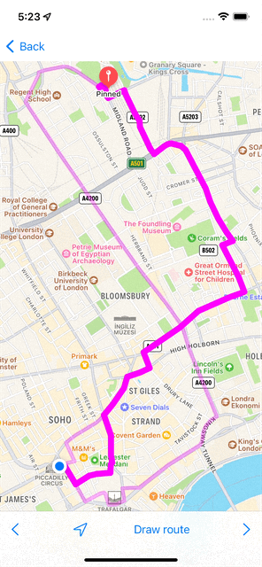
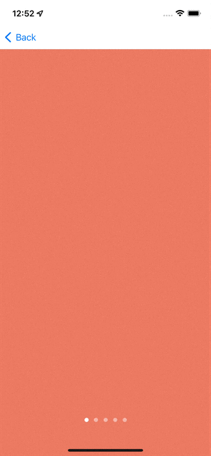

# HW5

Odev 1: MapViewController’a bir toolbar eklenerek bu toolbar icerisinde sag ve sol oklar bulunacaktir. Kullanici bir rota olusturdugunda varsa alternatif rotalar da eszamanli kullaniciya gosterilecek, toolbara konulan ok tuslari ile rotalar arasi gecis saglanacaktir. 

Odev 2: olusturulacak bir viewController icerisinde gazete uygulamalarindan aliskin oldugumuz bir banner slider yapilacaktir. viewController icerisine bir scrollView, scrollView icerisine de 5 adet her biri farkli renkte view eklenecektir. 
- bir viewdan bir sonraki view’a her 10 saniyede bir otomatik gecis yapilacaktir. 
- scrollView’da infiniteScroll ozelligi olacaktir. ornek slide senaryosu: 1 > 2 > 3 > 4 > 5 > 1 > 2

Not 1: Bu iki odev de mevcut uiComponents projemiz forklanarak uzerine yapilmalidir. Banner icin yeni viewController eklenerek icerisinde islem yapilacaktir. 

Not 2: Derste soylemis oldugumuz heroTransitions ile listeleme ekranindan detay ekranina gecis animasyonu ekleme odevinden vazgectim. Arzu eden ve vakit bulan mevcut projede denemeler yapip gonderebilir. 
